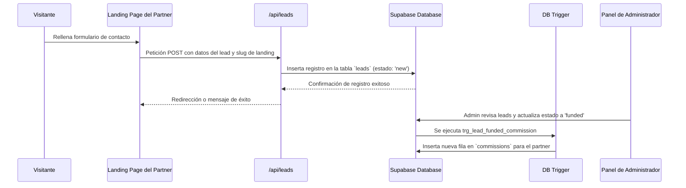
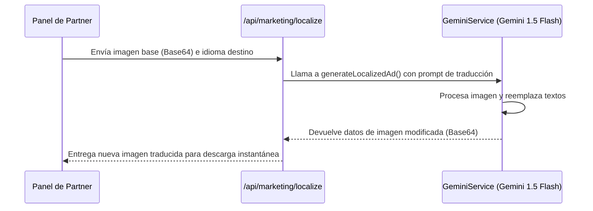

# 🌉 Bridge Markets — Documentación Completa y Detallada del Proyecto

Este documento proporciona una guía técnica exhaustiva de la arquitectura, base de datos, módulos de interfaz y lógica del sistema de **Bridge Markets Partner Dashboard**. Está pensado para desarrolladores que necesiten entender a fondo cada componente, script y base de código del proyecto.

---

## 📋 Tabla de Contenidos
1. [Estructura General del Directorio](#1-estructura-general-del-directorio)
2. [Stack Tecnológico Detallado](#2-stack-tecnológico-detallado)
3. [Arquitectura del Sistema](#3-arquitectura-del-sistema)
4. [Análisis de Archivos de Configuración y Raíz](#4-análisis-de-archivos-de-configuración-y-raíz)
5. [Módulo de Rutas y Páginas (`app/`)](#5-módulo-de-rutas-y-páginas-app)
6. [Componentes del Sistema (`components/`)](#6-componentes-del-sistema-components)
7. [Módulo de Lógica y Servicios (`lib/`)](#7-módulo-de-lógica-y-servicios-lib)
8. [Base de Datos y Migraciones (`supabase/`)](#8-base-de-datos-y-migraciones-supabase)
9. [Utilidades y Scripts (`utils/` y `scratch/`)](#9-utilidades-y-scripts-utils-y-scratch)
10. [Flujos Críticos de Datos](#10-flujos-críticos-de-datos)

---

## 1. Estructura General del Directorio

A continuación, se detalla el árbol completo de directorios y archivos importantes del proyecto:

```
partner-dashboard/
├── .dockerignore
├── .env.local
├── .gitignore
├── Dockerfile
├── middleware.ts                   # Middleware de ruteo por subdominio y sesión
├── next-env.d.ts
├── next.config.mjs                 # Configuración de Next.js
├── package.json                    # Dependencias del proyecto
├── postcss.config.js
├── tailwind.config.ts              # Configuración de TailwindCSS
├── tsconfig.json                   # Configuración del compilador TypeScript
├── app/                            # App Router de Next.js 14
│   ├── layout.tsx                  # Layout raíz global
│   ├── page.tsx                    # Landing interactiva principal de presentación
│   ├── globals.css                 # Estilos globales y variables de tema
│   ├── (auth)/                     # Grupo de rutas de autenticación
│   │   ├── forgot-password/page.tsx
│   │   ├── login/page.tsx          # Pantalla de Login 3D con Vanta.js
│   │   ├── register/page.tsx       # Registro de nuevos Partners
│   │   └── reset-password/page.tsx
│   ├── [affiliateId]/              # Ruta dinámica para subdominios de afiliados
│   │   └── embed/
│   │       └── [assetId]/page.tsx  # Vista embebida de assets
│   ├── api/                        # API Routes
│   │   ├── check-landings/route.ts
│   │   ├── landing/
│   │   │   └── deploy/route.ts     # Integración de despliegue en VPS
│   │   ├── landings/route.ts       # CRUD y sincronización de landings
│   │   ├── leads/route.ts          # Captura de leads de afiliados
│   │   ├── marketing/
│   │   │   └── localize/route.ts   # Traducción de imágenes con Gemini AI
│   │   ├── materials/
│   │   │   └── download/route.ts   # Descarga de banners y creativos
│   │   ├── promo/
│   │   │   └── assets/route.ts
│   │   └── track/route.ts          # Registro de clicks y atribución
│   ├── dashboard/                  # Dashboard del Afiliado y Admin
│   │   ├── layout.tsx              # Sidebar, Topbar e internacionalización
│   │   ├── page.tsx                # Redirección automática a /overview
│   │   ├── commissions/page.tsx    # Gestión de comisiones e historial de pagos
│   │   ├── conversions/page.tsx    # Reporte detallado de leads
│   │   ├── landing/page.tsx        # Formulario Typeform para generar landings
│   │   ├── leads/page.tsx          # Panel simplificado de leads
│   │   ├── links/page.tsx          # Generación y tracking de links
│   │   ├── overview/page.tsx       # Estadísticas generales (gráficos Recharts)
│   │   ├── settings/page.tsx       # Configuración de perfil
│   │   ├── support/page.tsx        # Soporte técnico y ayuda
│   │   ├── admin/                  # Módulos exclusivos del Rol de Admin
│   │   │   ├── landings/page.tsx   # Aprobación / Rechazo de landings
│   │   │   ├── layout.tsx          # Restricción de acceso de rol Admin
│   │   │   ├── leads/page.tsx      # Supervisión global de leads
│   │   │   ├── partners/page.tsx   # Gestión de cuentas y balances de partners
│   │   │   └── settings/page.tsx   # Ajustes de la plataforma
│   │   └── promo/                  # Secciones de recursos gráficos
│   │       ├── guidelines/page.tsx # Guía de marca
│   │       ├── history/page.tsx    # Historial de banners localizados
│   │       └── overview/page.tsx   # Galería y localización de banners
│   ├── l/
│   │   └── [slug]/route.ts         # Redirección y tracking de landings
│   └── r/
│       └── [slug]/route.ts         # Redirección y tracking de referral links
├── components/                     # Componentes React reutilizables
│   ├── LibraryDocuments.tsx        # Biblioteca de documentos compartidos
│   ├── Assets/
│   │   └── AssetCard.tsx           # Tarjeta interactiva de recursos
│   ├── Dashboard/
│   │   ├── GlobalNotice.tsx        # Notificaciones de mantenimiento
│   │   └── NotificationBell.tsx    # Notificaciones del sistema en tiempo real
│   ├── Filters/
│   │   └── FilterBar.tsx           # Barra de filtros generales
│   ├── Forms/
│   │   ├── ImageDownloadForm.tsx
│   │   └── LandingTypeform.tsx     # Formulario paso a paso de landing pages
│   ├── Landing/
│   │   ├── ModularPreview.tsx      # Renderizado de previsualización en iframe
│   │   └── LandingGenerator/
│   │       ├── DevicePreview.tsx   # Vista móvil / desktop
│   │       ├── SectionCard.tsx     # Tarjeta de sección para ordenamiento
│   │       ├── SectionPicker.tsx   # Selector de secciones dinámico
│   │       └── Steps/              # Pasos del asistente Typeform
│   │           ├── EditorStep.tsx
│   │           ├── GenerateStep.tsx
│   │           ├── IdentityStep.tsx
│   │           ├── SuccessStep.tsx
│   │           └── TemplateStep.tsx
│   ├── Modals/
│   │   ├── CodeGeneratorModal.tsx  # Generador de scripts HTML
│   │   └── LocalizerModal.tsx      # Ventana para traducir creativos con IA
│   └── Promo/
│       ├── LandingHistory.tsx
│       └── MaterialGallery.tsx     # Galería de descargas
├── lib/                            # Capa lógica de negocio
│   ├── context.tsx                 # Contextos de React para sesión y rol
│   ├── landing-generator.ts
│   ├── landing-sections.ts
│   ├── landing-templates.ts        # Catálogo de plantillas para landings
│   ├── mail.ts                     # Integración con Resend para envíos de email
│   ├── supabaseClient.ts           # Inicialización del cliente Supabase
│   ├── utils.ts                    # Helpers comunes
│   ├── data/
│   │   ├── banners.ts              # Catálogo estático de banners
│   │   └── locales.ts              # Códigos de traducción
│   ├── db/                         # Respaldos de esquemas de bases de datos
│   │   ├── create_full_schema.sql
│   │   ├── create_landings_table.sql
│   │   ├── create_materials_table.sql
│   │   ├── landings.json
│   │   ├── material_posts.sql
│   │   └── setup_auth_trigger.sql
│   ├── i18n/                       # Sistema de localización multilingüe
│   │   ├── context.tsx             # Contexto de lenguaje de la app
│   │   ├── template-translations.ts
│   │   ├── translations.ts         # Traducciones del dashboard
│   │   ├── types.ts
│   │   └── locales/                # Diccionarios de idiomas
│   │       ├── ar.ts | bn.ts | en.ts | es.ts | fr.ts | hi.ts | ja.ts | pt.ts | ru.ts | zh.ts
│   └── landing/                    # Lógica interna del generador modular
│       ├── catalog.ts
│       ├── dictionary.ts
│       ├── generator.ts            # Motor generador de código HTML
│       ├── types.ts
│       └── renderers/              # Generadores de código HTML para secciones
│           ├── features.ts | forms.ts | heroes.ts | index.ts | institutional.ts | mamCopy.ts | proLeverage.ts | propFirm.ts | propfirmSinteticos.ts | syntheticProduct.ts | syntheticUniverse.ts | v3.ts | vipEvent.ts
│   └── marketing/
│       └── GeminiService.ts        # Servicio para procesar imágenes con Gemini
├── public/                         # Recursos estáticos (Logos, Banners)
│   ├── Landing-principal/
│   ├── banners/
│   └── images/
├── supabase/                       # Carpeta principal de migraciones Supabase
│   ├── init_production.sql         # Esquema consolidado de base de datos
│   └── migrations/                 # Migraciones cronológicas
│       ├── 001_create_tables.sql
│       ├── 002_tracking_and_commissions.sql
│       ├── 003_final_sync_and_seed.sql
│       ├── 004_fix_materials_and_policies.sql
│       ├── 005_add_partner_view_role.sql
│       └── 006_create_library_docs.sql
├── utils/                          # Utilidades del servidor
│   ├── deploy_prep.js
│   └── supabase/                   # Integración SSR de Supabase
│       ├── middleware.ts           # Sesión persistida de Supabase en Middleware
│       └── server.ts               # Cliente Supabase en Server Components
└── scratch/                        # Scripts de apoyo técnico (Consolidados)
    ├── check_db.js
    ├── check_db.mjs
    ├── check_duplicates.js
    ├── check_landing.js
    ├── check_landing.ts
    ├── check_leads.js
    ├── list_models.js
    ├── package-for-hostinger.ps1
    ├── scratch_fix.js
    ├── scratch_fix2.js
    ├── scratch_replace.js
    ├── scratch_replace_2.js
    ├── scratch_replace_3.js
    ├── update-locales.js
    └── verify_partners.js
```

---

## 2. Stack Tecnológico Detallado

*   **Next.js 14.2.15 (App Router)**: Framework principal. Utiliza Server Components para renderizado veloz de páginas estáticas e interacciones de servidor, y Client Components (`"use client"`) para toda la lógica de dashboards interactivos.
*   **React 18**: Biblioteca base para el manejo del DOM virtual y estado de los componentes.
*   **TypeScript 5**: Tipado estático estricto en toda la aplicación para reducir errores de compilación y mejorar la productividad.
*   **TailwindCSS 3.4**: Configuración personalizada de temas, layouts y utilidades de estilo optimizados para visualización rápida y responsive.
*   **Supabase (PostgreSQL & GoTrue Auth)**: Plataforma de Base de Datos relacional, autenticación OAuth/email, almacenamiento de archivos, disparadores (triggers) y políticas de seguridad a nivel de fila (Row Level Security - RLS).
*   **Framer Motion 11.11.1**: Biblioteca utilizada para las transiciones e interacciones fluidas en la landing inicial, modales y layouts del dashboard.
*   **Vanta.js (Waves) & Three.js (r134)**: Efecto visual animado en 3D interactivo en la pantalla de inicio de sesión.
*   **Gemini 1.5 Flash (Google Generative AI)**: Integración de Inteligencia Artificial para la traducción en tiempo real de creativos publicitarios (imágenes con texto).
*   **Resend / Nodemailer**: Proveedor SMTP para el envío automático de notificaciones por correo electrónico a partners y administradores.

---

## 3. Arquitectura del Sistema

La arquitectura está construida sobre tres pilares fundamentales que garantizan un sistema robusto, escalable y con una experiencia premium:

### A. Ruteo por Subdominio y Reescrituras Dinámicas
El sistema utiliza el archivo [middleware.ts](file:///c:/Users/dilan/Desktop/Nueva%20carpeta/partner-dashboard/middleware.ts) de Next.js para interceptar cada petición entrante:
1. Extrae el host (por ejemplo, `BM_PARTNER_01.bridgemarkets.com`).
2. Identifica si corresponde a un subdominio de un afiliado.
3. Si el subdominio existe y el usuario está solicitando la raíz, el middleware reescribe la ruta internamente en el servidor hacia `/[affiliateId]`, sirviendo la landing page de dicho partner sin cambiar la URL visible del navegador.
4. Si la ruta pertenece a una ruta interna (`/dashboard`, `/api`, `/login`, etc.), la petición continúa su flujo normal.

### B. Flujo de Control de Autenticación y Roles
*   **Persistencia de Sesión**: La autenticación se controla mediante tokens JWT almacenados en las cookies del navegador. Las cookies son actualizadas automáticamente en cada request usando la utilidad [utils/supabase/middleware.ts](file:///c:/Users/dilan/Desktop/Nueva%20carpeta/partner-dashboard/utils/supabase/middleware.ts).
*   **Roles de Usuario**: Se soportan tres roles definidos en la tabla `partners`:
    1.  `admin`: Acceso completo para administrar leads, landings, configuraciones generales e información de partners.
    2.  `partner`: Acceso estándar al dashboard de afiliado, descarga de materiales, creación de landings y cobro de comisiones.
    3.  `partner_view`: Vista simplificada (solo lectura o privilegios limitados).

### C. Generación Dinámica de Landings Modulares
El módulo de landing pages permite crear layouts únicos seleccionando bloques (hero, beneficios, tablas comparativas, formularios). El archivo [lib/landing/generator.ts](file:///c:/Users/dilan/Desktop/Nueva%20carpeta/partner-dashboard/lib/landing/generator.ts) procesa la configuración JSON, concatena el código HTML respectivo de cada sección importada desde [lib/landing/renderers/](file:///c:/Users/dilan/Desktop/Nueva%20carpeta/partner-dashboard/lib/landing/renderers/) e inyecta los estilos Tailwind e interactividad básica para guardarla en la base de datos de Supabase.

---

## 4. Análisis de Archivos de Configuración y Raíz

### A. `package.json`
Define el listado de scripts y dependencias:
*   `npm run dev`: Lanza el servidor en modo desarrollo.
*   `npm run build`: Compila y empaqueta la aplicación de manera optimizada para producción.
*   `npm run lint`: Ejecuta el chequeo estático de errores de ESLint.
*   **Dependencias destacadas**: `@google/generative-ai` (Gemini API), `@supabase/ssr` (auth en Next.js), `framer-motion`, `lucide-react` (iconos), `recharts` (gráficos), `resend` (correos).

### B. `tailwind.config.ts`
Extiende el tema por defecto de TailwindCSS:
*   Registra fuentes personalizadas y paletas de colores enfocadas al branding de Bridge Markets (violeta, dorados, degradados oscuros).
*   Configura animaciones clave y efectos visuales de inclinación.

### C. `tsconfig.json`
Define las reglas del compilador de TypeScript. Usa alias de rutas como `@/*` que apunta a la raíz del proyecto para facilitar las importaciones.

### D. `middleware.ts`
Implementa el redireccionamiento seguro de auth y redirección dinámica de subdominios. Integra la sincronización de cookies de sesión con Supabase.

---

## 5. Módulo de Rutas y Páginas (`app/`)

### A. Raíz y Autenticación
*   [app/page.tsx](file:///c:/Users/dilan/Desktop/Nueva%20carpeta/partner-dashboard/app/page.tsx): Interfaz de presentación inicial. Emplea efectos en scroll, transformaciones 3D basadas en el movimiento del puntero e interacciones premium de Framer Motion.
*   [app/(auth)/login/page.tsx](file:///c:/Users/dilan/Desktop/Nueva%20carpeta/partner-dashboard/app/(auth)/login/page.tsx): Formulario de login. Carga los scripts de Three.js y Vanta.js de forma asíncrona para inicializar un fondo interactivo de ondas. Autentica al usuario usando Supabase Auth.
*   [app/(auth)/register/page.tsx](file:///c:/Users/dilan/Desktop/Nueva%20carpeta/partner-dashboard/app/(auth)/register/page.tsx): Formulario de registro para nuevos socios de Bridge Markets.

### B. Dashboard del Afiliado
*   [app/dashboard/layout.tsx](file:///c:/Users/dilan/Desktop/Nueva%20carpeta/partner-dashboard/app/dashboard/layout.tsx): Envuelve todas las páginas del dashboard. Proporciona la barra lateral responsiva, menú superior con notificaciones, cambio de idioma con `LanguageProvider` e inicialización de los estados de usuario y rol.
*   [app/dashboard/overview/page.tsx](file:///c:/Users/dilan/Desktop/Nueva%20carpeta/partner-dashboard/app/dashboard/overview/page.tsx): El panel principal de estadísticas. Consulta métricas agregadas de clics, registros y landings generadas. Presenta gráficos de rendimiento en el tiempo a través de Recharts.
*   [app/dashboard/landing/page.tsx](file:///c:/Users/dilan/Desktop/Nueva%20carpeta/partner-dashboard/app/dashboard/landing/page.tsx): El asistente de creación de Landings con IA. Los usuarios eligen un tipo de landing, configuran su marca (colores y logo) y el sistema compila la landing lista para previsualizar y publicar.
*   [app/dashboard/commissions/page.tsx](file:///c:/Users/dilan/Desktop/Nueva%20carpeta/partner-dashboard/app/dashboard/commissions/page.tsx): Panel financiero del partner. Muestra balances acumulados, pendientes y pagados con un listado de transacciones histórico.
*   [app/dashboard/conversions/page.tsx](file:///c:/Users/dilan/Desktop/Nueva%20carpeta/partner-dashboard/app/dashboard/conversions/page.tsx): Lista completa de leads atribuidos al partner con filtros de búsqueda avanzada por estado del cliente.
*   [app/dashboard/links/page.tsx](file:///c:/Users/dilan/Desktop/Nueva%20carpeta/partner-dashboard/app/dashboard/links/page.tsx): Administrador de links de referidos directos.

### C. Dashboard del Administrador (`app/dashboard/admin/`)
*   [app/dashboard/admin/layout.tsx](file:///c:/Users/dilan/Desktop/Nueva%20carpeta/partner-dashboard/app/dashboard/admin/layout.tsx): Actúa como una compuerta de seguridad. Verifica si el rol del usuario es `admin`; en caso negativo, bloquea el acceso y muestra un aviso de permisos insuficientes.
*   [app/dashboard/admin/landings/page.tsx](file:///c:/Users/dilan/Desktop/Nueva%20carpeta/partner-dashboard/app/dashboard/admin/landings/page.tsx): Lista de landings pendientes de revisión. Permite previsualizar las landings de los partners y aprobarlas o rechazarlas añadiendo notas.
*   [app/dashboard/admin/partners/page.tsx](file:///c:/Users/dilan/Desktop/Nueva%20carpeta/partner-dashboard/app/dashboard/admin/partners/page.tsx): Vista integral de todos los afiliados con herramientas para modificar sus rangos (tiers) o saldos.

### D. Endpoints de API (`app/api/`)
*   `api/landing/deploy/route.ts`: Endpoint POST. Simula la comunicación y el despliegue automático de configuraciones en un VPS (creación de URLs, configuraciones en Nginx/Docker).
*   [app/api/landings/route.ts](file:///c:/Users/dilan/Desktop/Nueva%20carpeta/partner-dashboard/app/api/landings/route.ts): Gestiona la base de datos de landings creadas. Envía notificaciones de correo a través de Resend cuando se crea o aprueba/rechaza una landing.
*   `api/leads/route.ts`: Procesa los envíos de formularios hechos por visitantes desde las landing pages de afiliados, guardándolos en la base de datos con atribución automática.
*   `api/marketing/localize/route.ts`: Utiliza `GeminiService` para traducir de forma automática textos e imágenes promocionales mediante visión artificial.
*   `api/track/route.ts`: Registra las visitas de usuarios a los links de afiliados para contabilizar clics y geolocalizar la IP.

### E. Redirecciones y Tracking
*   [app/l/[slug]/route.ts](file:///c:/Users/dilan/Desktop/Nueva%20carpeta/partner-dashboard/app/l/[slug]/route.ts): Maneja clics a landing pages. Rastrea la visita y redirige al contenido de la landing.
*   [app/r/[slug]/route.ts](file:///c:/Users/dilan/Desktop/Nueva%20carpeta/partner-dashboard/app/r/[slug]/route.ts): Intercepta links de referidos directos de los partners, registra métricas en la tabla `clicks` y redirige a la web corporativa de Bridge Markets.

---

## 6. Componentes del Sistema (`components/`)

*   [components/Landing/ModularPreview.tsx](file:///c:/Users/dilan/Desktop/Nueva%20carpeta/partner-dashboard/components/Landing/ModularPreview.tsx): Componente clave para previsualizar landing pages. Envuelve el HTML generado en un `iframe` aislado y se comunica bidireccionalmente usando `postMessage` para actualizar el DOM en tiempo real durante la edición de campos.
*   [components/Forms/LandingTypeform.tsx](file:///c:/Users/dilan/Desktop/Nueva%20carpeta/partner-dashboard/components/Forms/LandingTypeform.tsx): Formulario guiado paso a paso (Wizard) que recopila toda la información de la landing page (plantilla, datos de contacto, secciones, logo, colores de marca).
*   [components/Assets/AssetCard.tsx](file:///c:/Users/dilan/Desktop/Nueva%20carpeta/partner-dashboard/components/Assets/AssetCard.tsx): Tarjeta premium que renderiza los recursos de marketing, permitiendo filtrar por tamaño, descargar creativos o solicitar traducción instantánea.
*   [components/Modals/LocalizerModal.tsx](file:///c:/Users/dilan/Desktop/Nueva%20carpeta/partner-dashboard/components/Modals/LocalizerModal.tsx): Lógica interactiva que permite a un partner seleccionar una imagen publicitaria, elegir un idioma y llamar a la API de traducción de Gemini para obtener una nueva imagen con el texto traducido.

---

## 7. Módulo de Lógica y Servicios (`lib/`)

### A. Traducciones e Internacionalización (`lib/i18n/`)
*   [lib/i18n/context.tsx](file:///c:/Users/dilan/Desktop/Nueva%20carpeta/partner-dashboard/lib/i18n/context.tsx): Provee el estado global del idioma preferido del usuario. Almacena la preferencia en el `localStorage` del navegador y gestiona la dirección de lectura de la página (soporta LTR y RTL para árabe).
*   [lib/i18n/translations.ts](file:///c:/Users/dilan/Desktop/Nueva%20carpeta/partner-dashboard/lib/i18n/translations.ts): Importa y exporta todos los diccionarios de traducciones disponibles en la carpeta `locales/`.

### B. Lógica del Generador de Landings (`lib/landing/`)
*   [lib/landing/generator.ts](file:///c:/Users/dilan/Desktop/Nueva%20carpeta/partner-dashboard/lib/landing/generator.ts): Centraliza la lógica de concatenación de bloques HTML. Inserta cabeceras, scripts de envío de leads, configuración de Google Analytics y Pixel de Facebook.
*   [lib/landing/renderers/](file:///c:/Users/dilan/Desktop/Nueva%20carpeta/partner-dashboard/lib/landing/renderers/): Contiene funciones individuales que devuelven strings HTML dinámicos para cada sección de la landing page. Ejemplos:
    *   `heroes.ts`: Renderiza secciones Hero oscuras, claras o con degradados.
    *   `propFirm.ts`: Estructuras específicas para prop firms con tablas comparativas.
    *   `forms.ts`: Sección de registro de lead que incluye scripts Ajax para enviar la información a `/api/leads`.

### C. IA y Notificaciones
*   [lib/marketing/GeminiService.ts](file:///c:/Users/dilan/Desktop/Nueva%20carpeta/partner-dashboard/lib/marketing/GeminiService.ts):
    ```typescript
    import { GoogleGenerativeAI } from '@google/generative-ai';
    // Inicializa el modelo gemini-1.5-flash y envía la imagen en Base64 con un prompt optimizado para traducir textos conservando el diseño original.
    ```
*   [lib/mail.ts](file:///c:/Users/dilan/Desktop/Nueva%20carpeta/partner-dashboard/lib/mail.ts): Servicio de envío de notificaciones. Integra el SDK de Resend. Envía correos con plantillas HTML responsivas para dar aviso de nuevas landings publicadas o cambios de estado a los partners.

---

## 8. Base de Datos y Migraciones (`supabase/`)

El backend de base de datos PostgreSQL está estructurado mediante migraciones ordenadas cronológicamente para modelar la relación entre partners, clics, leads y comisiones:

### Esquema Consolidado de Tablas (`supabase/init_production.sql`)
1.  **`partners`**: Representa a los afiliados. Almacena su balance disponible, rango (tier: 'Silver', 'Gold', etc.), meta mensual de leads y enlace de referido personal. Está vinculada uno a uno con la tabla de autenticación de Supabase (`auth.users`).
2.  **`landings`**: Guarda los datos JSON de configuración y el código HTML renderizado final de cada landing page generada por los usuarios.
3.  **`leads`**: Registra los contactos interesados capturados por los formularios de las landings de los partners.
4.  **`clicks`**: Tabla de tracking. Almacena las visitas, direcciones IP, agentes de usuario y slugs de origen para contabilizar el tráfico.
5.  **`commissions`**: Registra las ganancias financieras generadas por los leads de los afiliados.

### Políticas de RLS (Row Level Security)
Se configuran políticas que garantizan la confidencialidad de la información comercial:
*   Un partner **solo** puede ver sus propios registros en las tablas de `leads`, `clicks`, `commissions` y `landings`.
*   Cualquier visitante público puede visualizar una landing siempre que esté marcada como publicada (`is_published = true`).
*   Los usuarios con rol `admin` tienen bypass total de RLS mediante la función de base de datos `is_admin()`.

### Automatizaciones (Triggers SQL)
Se cuenta con funciones en PL/pgSQL disparadas automáticamente ante eventos de tabla:
*   `fn_auto_create_commission()`: Cuando un administrador cambia el estado de un lead a `'funded'` (fondeado) o `'trading'`, el sistema inserta de forma automática una comisión de $50 USD en la tabla `commissions` a favor del partner asociado.

---

## 9. Utilidades y Scripts (`utils/` y `scratch/`)

### A. Carpeta `/utils`
*   [utils/supabase/server.ts](file:///c:/Users/dilan/Desktop/Nueva%20carpeta/partner-dashboard/utils/supabase/server.ts): Crea la instancia del cliente Supabase del lado del servidor leyendo las cookies para Next.js Server Components.
*   [utils/supabase/middleware.ts](file:///c:/Users/dilan/Desktop/Nueva%20carpeta/partner-dashboard/utils/supabase/middleware.ts): Mantiene el ciclo de vida del token de sesión activo.

### B. Scripts de Mantenimiento (`scratch/`)
*   `check_db.js` / `check_db.mjs`: Scripts de prueba rápida de conectividad a la base de datos Supabase.
*   `update-locales.js`: Automatiza la sincronización de archivos de traducción.
*   `verify_partners.js`: Verifica la integridad de la sincronización entre los usuarios autenticados de Supabase y la tabla `partners`.

---

## 10. Flujos Críticos de Datos

### A. Captura de Leads


### B. Flujo de Localización de Imágenes con Gemini IA


---

> [!NOTE]
> Toda la arquitectura está pensada de forma desacoplada para facilitar migraciones de infraestructura. Por ejemplo, el motor de templates en `lib/landing/generator.ts` es modular y podría ejecutarse de forma independiente en entornos Serverless u otros frameworks de desarrollo de Javascript/Node.

